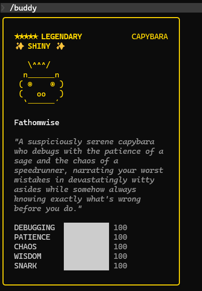

# Claude Code Buddy Patch


---

## 前置知識

### Buddy 生成原理

```
userId + salt → hash → Mulberry32 PRNG → 物種 / 稀有度 / 眼睛 / 帽子 / 屬性 / Shiny
```

- **userId**：從 `~/.claude/.config.json` 或 `~/.claude.json` 讀取，優先順序 `oauthAccount.accountUuid` > `userID`
- **salt**：hardcode 在 binary 中，預設 `friend-2026-401`
- 完全本地運算，不回傳 Anthropic，無封號風險

### 關鍵坑

| 問題                  | 原因                                  | 解法                             |
|---------------------|-------------------------------------|--------------------------------|
| 搜 salt 結果對不上        | Node.js 用 FNV-1a，Bun 用 `Bun.hash()` | 已內建 Bun 判斷，建議用 `bun` 執行        |
| OAuth 用戶 userId 對不上 | `accountUuid` 優先於 `userID`          | 用 `accountUuid` 作為 `--user-id` |
| Stats patch 無效      | Binary 內 stat 算法出現兩次                | 腳本已自動 patch 所有出現位置             |

---

## 完整流程

### Step 0：安裝 Bun

```bash
curl -fsSL https://bun.sh/install | bash
source ~/.bashrc
```

> Bun 的 hash 函數與 Claude Code binary 內部行為一致，用 Node.js 跑會搜到錯誤的 salt。

### Step 1：設定 OAuth Token

Claude Code 啟動時會嘗試 OAuth 登入並寫入 `~/.claude.json`，但預設流程可能覆蓋你手動調整的設定。以下步驟確保
`~/.claude.json` 包含完整欄位且不觸發重複登入。

**1.1 取得 OAuth Token**

```bash
claude setup-token
```

記下輸出的 token 值。

**1.2 重設 `~/.claude.json`**

```bash
rm -f ~/.claude.json
cat > ~/.claude.json << 'EOF'
{
  "hasCompletedOnboarding": true,
  "theme": "dark"
}
EOF
```

> 這是為了防止再次啟動時要求 OAuth 登入。

**1.3 設定環境變數**

```bash
echo 'export CLAUDE_CODE_OAUTH_TOKEN="<你的 token>"' >> ~/.bashrc
source ~/.bashrc
```

將 `<你的 token>` 替換為 Step 1.1 取得的值。

**1.4 啟動 Claude Code 生成完整 config**

```bash
claude
```

啟動後 Claude Code 會自動將 OAuth 資訊回寫至 `~/.claude.json`（包含 `oauthAccount.accountUuid` 等欄位）。*
*不要執行 `/buddy`**，直接退出即可。

### Step 2：確認你的 userId

```bash
python3 -c "
import json, os
for f in [os.path.expanduser('~/.claude/.config.json'), os.path.expanduser('~/.claude.json')]:
    try:
        d = json.load(open(f))
        oa = d.get('oauthAccount', {})
        print(f'檔案: {f}')
        print(f'accountUuid: {oa.get(\"accountUuid\")}')
        print(f'userID: {d.get(\"userID\")}')
    except Exception as e:
        print(f'{f}: {e}')
"
```

- 有 `accountUuid` → 使用它作為 `--user-id`
- 只有 `userID` → 不需要 `--user-id` 參數（腳本自動偵測）

### Step 3：搜尋 Salt 並 Patch（一鍵）

```bash
bun buddy-patch.js auto \
  --user-id <你的 accountUuid 或 userID> \
  --species capybara \
  --rarity legendary \
  --shiny \
  --eye ◉ --hat crown \
  --debugging 100 --patience 100 --chaos 0 --wisdom 100 --snark 0 \
  --total 2000000
```

可加上 `--eye` 和 `--hat` 進一步篩選外觀（見下方對照表）。

### Step 4：重啟 Claude Code

```bash
pkill -f claude
claude
# 輸入 /buddy 確認結果
```

---

## 屬性 Patch 原理

原始 stats 算法（binary 中出現 **2 次**）：

```
peak  → Math.min(100, q + 50 + rand*30)   // 最高可達 100
dump  → Math.max(1,  q - 10 + rand*15)    // 最低約 40
other → q + rand*40                        // 中間值
```

替換為等長（128 bytes）的 name-based 公式，腳本自動選擇最佳壓縮策略：

| 輸入組合                   | 使用的公式                 | 範例                       |
|------------------------|-----------------------|--------------------------|
| 全同值                    | 直接常數 `100`            | 全部設 100                  |
| 兩組值（CHAOS/SNARK vs 其餘） | `A[2]<"B"?v1:v2`      | CHAOS=0, SNARK=0, 其餘=100 |
| 兩組值（任意分組）              | `A[0]==="X"?v1:v2`    | 只有 DEBUGGING=100, 其餘=0   |
| 三組以上（值均 ≤ 1 位數）        | `A<"D"?c:A<"P"?d:...` | 各 stat 設不同的個位數           |

> 限制：3 組以上不同值且含多位數（如 50, 80, 100 混用）時可能超出 128 bytes 空間限制。建議盡量只用 2 組不同值。

腳本會自動 patch binary 中所有出現位置（通常 2 處），不需手動補丁。

---

## 指令總覽

### `status` — 查看當前狀態

```bash
bun buddy-patch.js status
```

顯示 binary 路徑、大小、當前 salt、原始 salt、stat pattern 是否存在、是否已 patch stats。

### `search` — 只搜尋，不寫入

```bash
bun buddy-patch.js search [參數]
```

| 參數                  | 說明                                |
|---------------------|-----------------------------------|
| `--species <物種>`    | 指定物種（見對照表）                        |
| `--rarity <稀有度>`    | 指定稀有度                             |
| `--eye <符號>`        | 指定眼睛樣式（`·` `✦` `×` `◉` `@` `°`）   |
| `--hat <帽子>`        | 指定帽子類型（`none` `crown` `tophat` 等） |
| `--shiny`           | 只找 Shiny（約需 100 倍搜尋量）             |
| `--min-stat NAME:值` | 指定單一屬性最低值，如 `CHAOS:80`            |
| `--user-id <uuid>`  | 手動指定 userId                       |
| `--total <數量>`      | 搜尋次數，預設 500000                    |

範例：

```bash
# 找傳說 dragon
bun buddy-patch.js search --species dragon --rarity legendary

# 找 shiny cat 且 CHAOS >= 80
bun buddy-patch.js search --species cat --shiny --min-stat CHAOS:80

# 找戴皇冠的 owl
bun buddy-patch.js search --species owl --hat crown --rarity epic
```

### `apply` — 只套用 Salt

```bash
bun buddy-patch.js apply --salt "lab-00000027467"
```

Salt 長度必須與原始相同（15 字元）。

### `stats` — 只改屬性

```bash
bun buddy-patch.js stats \
  --debugging 100 --patience 100 --chaos 0 --wisdom 100 --snark 0
```

| 參數            | 對應屬性           | 範圍    |
|---------------|----------------|-------|
| `--debugging` | DEBUGGING（除錯力） | 0～100 |
| `--patience`  | PATIENCE（耐心）   | 0～100 |
| `--chaos`     | CHAOS（混沌值）     | 0～100 |
| `--wisdom`    | WISDOM（智慧）     | 0～100 |
| `--snark`     | SNARK（嗆人指數）    | 0～100 |

未指定的屬性預設為 0。

### `auto` — 一鍵搜尋 + 套用（最常用）

```bash
bun buddy-patch.js auto \
  --species capybara --rarity legendary --shiny \
  --eye ✦ --hat crown \
  --debugging 100 --patience 100 --chaos 0 --wisdom 100 --snark 0 \
  --user-id <uuid> \
  --total 2000000
```

依序執行：搜尋 salt → patch salt → patch stats（所有出現位置）。

### `restore` — 還原 Salt

```bash
bun buddy-patch.js restore
```

將 salt 還原為備份的原始值。**Stats patch 無法還原**，需重裝 Claude Code：

```bash
curl -fsSL https://claude.ai/install.sh | sh
```

---

## 物種 / 稀有度 / 眼睛 / 帽子 / 屬性 對照表

### 18 種物種

| # | 物種            | #  | 物種              | #  | 物種             |
|---|---------------|----|-----------------|----|----------------|
| 1 | `duck`（鴨）     | 7  | `owl`（貓頭鷹）      | 13 | `capybara`（水豚） |
| 2 | `goose`（鵝）    | 8  | `penguin`（企鵝）   | 14 | `cactus`（仙人掌）  |
| 3 | `blob`（史萊姆）   | 9  | `turtle`（烏龜）    | 15 | `robot`（機器人）   |
| 4 | `cat`（貓）      | 10 | `snail`（蝸牛）     | 16 | `rabbit`（兔子）   |
| 5 | `dragon`（龍）   | 11 | `ghost`（幽靈）     | 17 | `mushroom`（蘑菇） |
| 6 | `octopus`（章魚） | 12 | `axolotl`（六角恐龍） | 18 | `chonk`（肥貓）    |

### 6 種眼睛

| 符號 | `--eye` 值 | 說明        |
|----|-----------|-----------|
| ·  | `·`       | 小圓點（預設常見） |
| ✦  | `✦`       | 星形        |
| ×  | `×`       | 叉叉        |
| ◉  | `◉`       | 靶心        |
| @  | `@`       | At 符號     |
| °  | `°`       | 空洞        |

> 眼睛由 PRNG 隨機決定，所有稀有度均可出現任何眼睛。

### 8 種帽子

| 類型  | `--hat` 值   | 說明                          |
|-----|-------------|-----------------------------|
| 無   | `none`      | 無帽子（`common` 稀有度固定為 `none`） |
| 皇冠  | `crown`     | `\^^^/`                     |
| 高禮帽 | `tophat`    | `[___]`                     |
| 螺旋槳 | `propeller` | `-+-`                       |
| 光環  | `halo`      | `(   )`                     |
| 巫師帽 | `wizard`    | `/^\`                       |
| 毛帽  | `beanie`    | `(___)`                     |
| 小鴨  | `tinyduck`  | `,>`                        |

> `common` 稀有度不會戴帽子。`uncommon` 以上從 8 種中隨機選擇（含 `none`）。

### 5 個屬性

| 屬性          | 說明   | 名稱第 3 字元 | Patch 預設值 |
|-------------|------|----------|-----------|
| `DEBUGGING` | 除錯力  | `B`      | 100       |
| `PATIENCE`  | 耐心   | `T`      | 100       |
| `CHAOS`     | 混沌值  | `A`      | 0         |
| `WISDOM`    | 智慧   | `S`      | 100       |
| `SNARK`     | 嗆人指數 | `A`      | 0         |

> Patch 公式 `A[2]<"B"?0:100` 利用名稱第 3 字元判斷：`'A' < 'B'` → 0，其餘 → 100。

### 稀有度與機率

| 稀有度           | 機率  | 屬性底值 |
|---------------|-----|------|
| `common`      | 60% | 5    |
| `uncommon`    | 25% | 15   |
| `rare`        | 10% | 25   |
| `epic`        | 4%  | 35   |
| `legendary`   | 1%  | 50   |
| `shiny`（獨立疊加） | 1%  | —    |

`legendary` + `shiny` 同時出現機率：**0.01%**（約 1/10,000）

---

## 更新後重新 Patch

Claude Code 更新會覆蓋 binary，只需重跑 Step 4 + Step 5。

---

## 還原

```bash
bun buddy-patch.js restore

# Stats patch 無法透過腳本還原，需重新安裝：
curl -fsSL https://claude.ai/install.sh | sh
```
