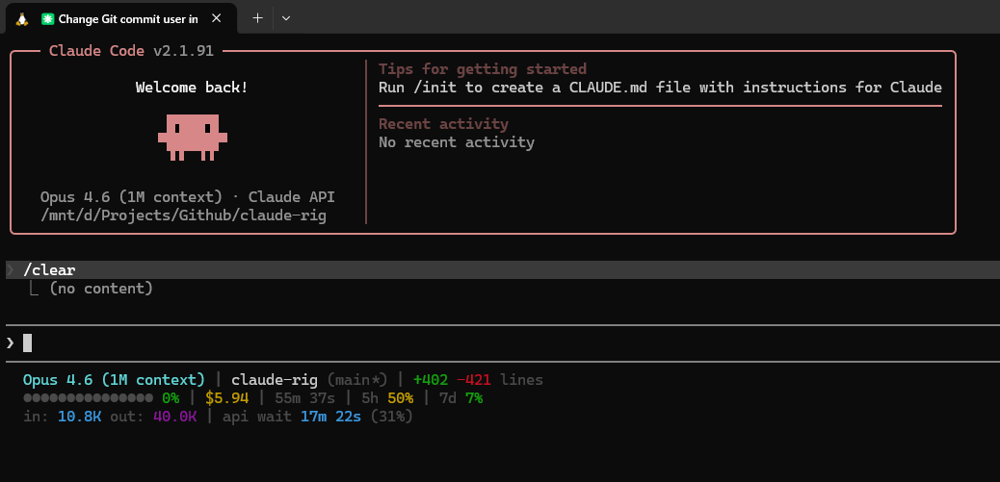

# Statusline

三行即時儀表板，單次 `jq` 解析（~3ms），git 快取 5 秒，所有欄位皆可透過 `SHOW_XXX` 開關控制。



## Line 1 — Header

模型、工作區、程式碼異動一目了然。

| 欄位             | 顏色               | 來源                                                           | 預設   |
|----------------|------------------|--------------------------------------------------------------|------|
| Model 名稱       | cyan 粗體          | `model.display_name`                                         | ✅    |
| Context size   | dim              | 智慧顯示：model name 沒帶 "context" 時才補上                            | ✅    |
| Version        | dim              | `version`                                                    | ❌    |
| Repo / Dir     | white            | `workspace.current_dir` 的最後一段目錄名                             | ✅    |
| Git branch     | dim              | `worktree.branch` 或 `git branch --show-current`，dirty 時帶 `*` | ✅    |
| Lines changed  | green/red        | `cost.total_lines_added/removed`，+0/-0 時隱藏                   | ✅    |
| Git file stats | yellow/green/red | `git diff` 計算 Modified/Added/Deleted 檔案數                     | ✅    |
| Agent          | magenta          | `agent.name`，無 agent 時隱藏                                     | ✅    |
| Vim mode       | blue/green       | `vim.mode`，NOR/INS                                           | auto |

## Line 2 — Status

Context 健康度、費用、時間、速率限制。

| 欄位            | 說明                                               | 預設 |
|---------------|--------------------------------------------------|----|
| Context bar   | 15 格 `●` 圓點，整條單色（<50% 綠、<80% 黃、≥80% 紅），≥90% 顯示 ⚠ | ✅  |
| Cost          | `$x.xx`，$0.00 時 dim 顯示，$0.01–$9.99 黃色，≥$10 紅色    | ✅  |
| Duration      | session 持續時間，0 時隱藏                               | ✅  |
| 5h rate limit | 百分比 + 重置倒數計時                                     | ✅  |
| 7d rate limit | 百分比 + 重置倒數計時                                     | ✅  |

## Line 3 — Performance

Token 消耗、API 效率、快取命中率。全為 0 時整行不輸出。

| 欄位            | 顏色        | 說明                                                     | 預設 |
|---------------|-----------|--------------------------------------------------------|----|
| Input tokens  | cyan      | 累計 input tokens                                        | ✅  |
| Output tokens | magenta   | 累計 output tokens                                       | ✅  |
| API wait      | cyan      | API 等待時間 + 佔總時間百分比                                     | ✅  |
| Cache hit     | green→red | `cache_read / (cache_read + input + cache_create)` 命中率 | ✅  |

## Smart Hiding

零值不佔空間：

- Lines `+0 -0` → 隱藏
- Duration ≤1s → 隱藏
- Git file stats 全 0 → 隱藏
- Agent / Vim 無資料 → 隱藏
- Rate limits 無資料 → 隱藏
- Tokens / API wait / Cache 全 0 → 整行不輸出
- Cost `$0.00` → 保留但 dim 灰顯示

## Configuration

編輯 `~/.claude/statusline.sh` 頂部的開關：

```bash
SHOW_MODEL=1            # 模型名稱
SHOW_CTX_SIZE=1         # context size 智慧補上
SHOW_VERSION=0          # Claude Code 版本號
SHOW_DIR=1              # 工作目錄 / repo link
SHOW_GIT_BRANCH=1       # git branch + dirty
SHOW_GIT_FILES=1        # git file stats (M/A/D)
SHOW_LINES=1            # +n -n lines
SHOW_AGENT=1            # agent / worktree
SHOW_CONTEXT_BAR=1      # ● 圓點進度條
SHOW_COST=1             # session 費用
SHOW_DURATION=1         # session 時間
SHOW_RATE_LIMITS=1      # 5h / 7d 速率限制
SHOW_TOKENS=1           # in / out tokens
SHOW_API_WAIT=1         # api wait + 佔比
SHOW_CACHE_HIT=1        # cache 命中率
```

## Testing

不用啟動 Claude Code 即可測試：

```bash
echo '{"model":{"display_name":"Opus 4.6 (1M context)"},"workspace":{"current_dir":"/home/user/my-project"},"cost":{"total_cost_usd":2.50,"total_duration_ms":600000,"total_api_duration_ms":300000,"total_lines_added":256,"total_lines_removed":42},"context_window":{"used_percentage":38,"context_window_size":1000000,"total_input_tokens":350000,"total_output_tokens":80000,"current_usage":{"input_tokens":12000,"cache_read_input_tokens":95000,"cache_creation_input_tokens":8000}},"rate_limits":{"five_hour":{"used_percentage":25},"seven_day":{"used_percentage":8}}}' | ~/.claude/statusline.sh
```

## Requirements

- `jq`（`brew install jq` / `apt install jq`）
- Bash 3.2+（macOS 預設相容）
- Claude Code v1.0.80+
